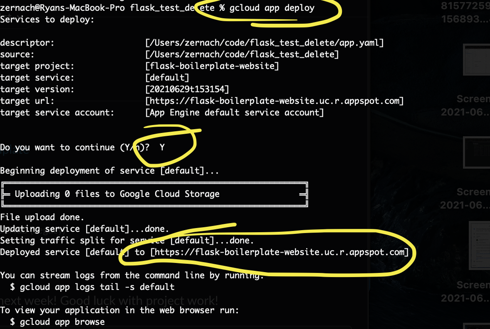

# Google Cloud App Engine Website
## Website Template Built Using Python's Flask

### Instructions

1. Install the [Google Cloud SDK](https://cloud.google.com/sdk/).

2. Create a new project in the [Google Cloud Console](https://console.cloud.google.com/). When it asks you for a Project Name, please remember that the name of your project will be listed in your new website's default URL. For example, a GCloud project name of `flask-boilerplate-website` will result in a URL of [https://flask-boilerplate-website.uc.r.appspot.com](https://flask-boilerplate-website.uc.r.appspot.com). Optionally, you can always purchase a new domain name, such as flask-boilerplate-website.com, and then mirror your site to the professional URL.

3. After your project has finished being created (it may take a minute or two), select your new project.

4. Next, download this entire repository to your machine as a ZIP file. Open the Flask_Boilerplate_Website_Template directory in your terminal (or in GitBash if on Windows). With that folder open, run `gcloud init`, and when it prompts your for which project to select, type the number that corresponds to your new project name. Running `gcloud init` is a one-time step, so that your computer knows that the directory that you're in can be pushed to GCloud.

5. Now that you've initalized your directory, run `gcloud app deploy`. Usually this is a super simple command, but this first time you run this command to deploy to a live website, it'll ask you which location you'd like to deploy to. I usually use `us-central` (option number 17), because it will result in moderate speeds for anyone in the United States. If most of your users are in New York or California, then you may want to choose a more appropriate location to host your site, such as Eatsern or Western hosting zones. After selecting the locatio , then type `Y` when it asks you Y or n. After typing `Y`, if it gives you an error, then simply run `gcloud app deploy` again. Please see success message in screenshot below:

